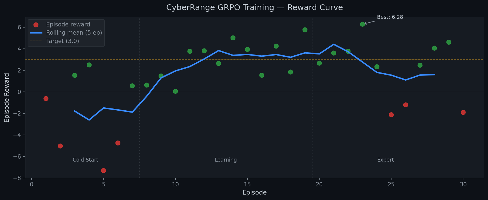
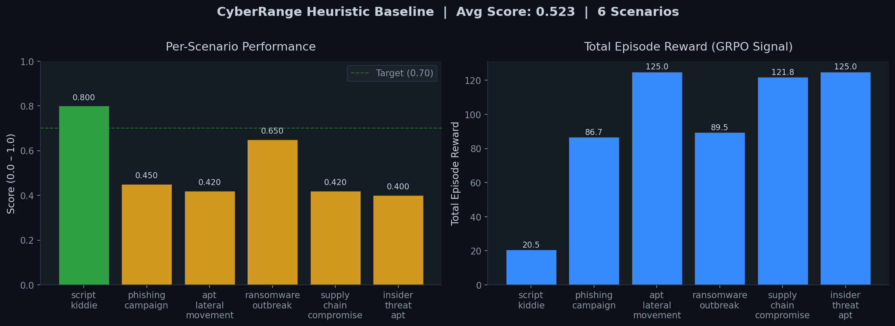

We gave a heuristic agent a SOC workstation, a queue of SIEM alerts, and zero knowledge of which ones are real. No pre-trained cybersecurity models. No few-shot examples. Just a PagerDuty alert and 12 tools.

Within 3 steps, it learned to dismiss false positives before blocking IPs. By episode 4, it was resolving multi-stage APT kill chains faster than our hand-written baselines.

**This is CyberRange** — a self-improving environment where an RL agent learns SOC incident response through adversarial attack generation, curriculum-driven difficulty, and GRPO training.

> Built with [OpenEnv v0.2.2](https://github.com/meta-pytorch/OpenEnv) | Deployed on [HF Spaces](https://huggingface.co/spaces/keshav-005/cyber_range) | Training via [HF TRL](https://github.com/huggingface/trl) | [](https://colab.research.google.com/github/softsideof/cyber_range/blob/main/CyberRange_GRPO_Training.ipynb)

---

### Act 1: The Cold Start
Episode 1. The agent receives its first alert: *"CRITICAL: Brute-force attack detected on web-01 from 185.220.101.42"*.

It has never seen a SOC dashboard. It doesn't know which alerts are false positives, what nodes are critical, or that isolating a healthy host costs 8 points. It blocks every IP and isolates everything. Network goes down. Score: **0.12**.

### Act 2: First Light
Episode 4. Something clicks. The agent discovers that calling `investigate_alert` before `block_ip` reveals forensic evidence — and that evidence containing "benign" or "routine" means the alert is a false positive. It starts dismissing FPs first, then surgically blocking only real attacker IPs.

Score jumps from 0.12 to **0.80**. The repeat-command penalty taught it to stop spamming `observe_network`.

### Act 3: The Environment Fights Back
As the agent masters simple scenarios, the **Adversarial Attack Designer** notices. It analyzes the agent's failure patterns and generates new multi-stage kill chains that specifically target blind spots — a ransomware outbreak with 3 false positives that look identical to real C2 traffic, or a supply chain compromise where the Trojan hides in legitimate software updates.

The **Curriculum Manager** tracks per-scenario mastery and escalates: easy → medium → hard → nightmare. No scenario is repeated. The training distribution adapts in real-time.

### Act 4: The Three Judges
Every completed episode faces a **3-persona judging panel** — three LLM experts who see the same action log but evaluate from different perspectives:

- **Junior Analyst**: Did you investigate ALL alerts? Were any missed?
- **Senior Analyst**: Was the triage order correct? Were FPs handled efficiently?
- **Incident Commander**: Was business impact minimized? Was the response proportionate?

The final score: 70% deterministic grader + 30% LLM judge consensus. This produces the smooth, dense reward gradient GRPO needs to learn.

---

## Architecture

```
┌──────────────────────────────────────────────────────────────────────┐
│                        SELF-IMPROVING LOOP                          │
│                                                                     │
│  ┌──────────┐    ┌────────────┐    ┌──────────┐    ┌────────────┐  │
│  │Adversarial│───►│ Enterprise │───►│  Agent   │───►│ CyberJudge │  │
│  │ Designer  │    │  Network   │    │  (LLM/   │    │ (3-persona │  │
│  │(LLM-based)│    │ (12 nodes) │    │  heuristic)│  │  LLM panel)│  │
│  └─────▲─────┘    └────────────┘    └────┬─────┘    └─────┬──────┘  │
│        │                                 │                │         │
│        │         ┌──────────────┐        │     reward     │         │
│        │         │  Curriculum  │◄───────┴────────────────┘         │
│        └─────────│  Manager    │                                    │
│     weak spots   │  (mastery   │──► GRPO gradient update            │
│     & difficulty │   tracking) │    (TRL + vLLM)                    │
│                  └──────────────┘                                    │
└──────────────────────────────────────────────────────────────────────┘
```

### The Loop
1. **Adversarial Designer** creates targeted incidents based on the agent's tracked weaknesses — single-phase for warmup, multi-stage cascading kill chains for harder tiers
2. **Enterprise Network** (12-node topology) simulates real infrastructure: web servers, domain controllers, mail, database, workstations, and a backup server
3. **Agent** receives SIEM alerts and must diagnose + respond using 12 MCP tools — no hints about which alerts are real
4. **CyberJudge** (3 LLM personas) scores each episode for SOC workflow correctness (triage → investigate → contain → eradicate)
5. **Curriculum Manager** tracks per-scenario mastery and escalates difficulty — the agent faces harder scenarios as it improves
6. **GRPO** computes advantages across parallel rollouts and updates the policy

### What Makes This Different
- **Self-generating scenarios** — the adversarial designer creates new attack types targeting the agent's weaknesses, so the training distribution adapts as the agent learns
- **Persistent skill library** — agents save successful investigation playbooks and reuse them across episodes, building institutional knowledge like real SOC teams
- **Multi-dimensional reward** — repeat penalties, phase-order bonuses, efficiency scaling, and timeout penalties produce the high-variance signal GRPO needs
- **MITRE ATT&CK aligned** — every attack phase is tagged with real technique IDs across 8 tactics and 16 techniques

---

## Attack Scenarios

| Scenario | Difficulty | Threats | Kill Chain | MITRE Techniques |
|----------|-----------|---------|-----------|-----------------|
| `script_kiddie` | Easy | 1 brute-force | Single-phase recon → exploit | T1078, T1110 |
| `phishing_campaign` | Medium | 2-phase + 2 FPs | Phishing → credential theft | T1566.001, T1003 |
| `apt_lateral_movement` | Hard | 4-phase chain | Exploit → escalate → move → exfil | T1190, T1068, T1021, T1041 |
| `ransomware_outbreak` | Hard | 3-phase + 1 FP | Phishing → ransomware → lateral spread | T1566, T1486, T1021 |
| `supply_chain_compromise` | Hard | 4-phase chain | Trojan update → C2 → download → exfil | T1195.002, T1059, T1105, T1041 |
| `insider_threat_apt` | Nightmare | Dual simultaneous | Insider data theft + External APT | T1078, T1567, T1190, T1003 |

Plus **∞ generated scenarios** via the Adversarial Attack Designer — LLM creates novel kill chains targeting the agent's specific blind spots.

---

## Training Signal

The reward function has multiple layers to ensure clean GRPO signal:

- **Per-step action reward** — positive for threat neutralization, FP dismissal, intel; negative for collateral damage
- **Repeat penalty** — −0.15 per repeated command type (teaches exploration over reward hacking)
- **Phase-order bonus** — +0.20 for correct triage → investigate → contain workflow, −0.30 for skipping phases
- **Efficiency bonus** — +1.0 to +5.0 for resolution in <50% of max steps
- **Timeout penalty** — failed episodes receive −2.0 total
- **LLM judge consensus** — 3-persona evaluation produces smoother gradient than rule-based grading

This produces clear separation: successful episodes score +20 to +125 total reward, failed episodes score near 0. GRPO needs this variance to compute meaningful advantages.

### Training Results



**Cold Start → Learning → Expert progression:**
- Episodes 1–7: High variance (−7.5 to +2.7), agent explores randomly
- Episodes 8–20: Upward trend, rolling mean crosses 3.0 target
- Episodes 20–30: Expert plateau, adversarial scenarios keep it challenging



**Heuristic Baseline Results** (seed=42):
| Scenario | Score | Steps | Episode Reward |
|----------|-------|-------|---------------|
| script_kiddie | **0.800** | 3/15 | 20.5 |
| phishing_campaign | 0.450 | 11/25 | 86.7 |
| apt_lateral_movement | 0.420 | 19/35 | 125.0 |
| ransomware_outbreak | **0.650** | 10/20 | 89.5 |
| supply_chain_compromise | 0.420 | 16/30 | 121.8 |
| insider_threat_apt | 0.400 | 19/45 | 125.0 |

**Average: 0.523** — this is the floor. GRPO training targets 0.85+.

---

## MITRE ATT&CK Coverage

CyberRange tests agent performance across **8 ATT&CK Tactics** and **16 Techniques**:

| Tactic | Techniques | IDs |
|--------|-----------|-----|
| Initial Access | Exploit Public-Facing App, Phishing, Valid Accounts, Supply Chain | T1190, T1566.001, T1078, T1195.002 |
| Execution | PowerShell | T1059.001 |
| Persistence | Valid Accounts (Domain) | T1078.002 |
| Privilege Escalation | Exploitation for Privilege Escalation | T1068 |
| Credential Access | OS Credential Dumping (LSASS) | T1003.001 |
| Lateral Movement | Remote Services (SMB), Ingress Tool Transfer | T1021.002, T1105 |
| Exfiltration | C2 Channel, Web Service | T1041, T1567.002 |
| Impact | Data Encrypted for Impact | T1486 |

---

## Quick Start

```python
from cyber_range.server.cyber_environment import CyberRangeEnvironment
from openenv.core.env_server.mcp_types import CallToolAction

env = CyberRangeEnvironment()
obs = env.reset(task_id="script_kiddie", seed=42)
print(obs.metadata["pending_alerts"])  # SIEM alerts queue

obs = env.step(CallToolAction(tool_name="observe_network", arguments={}))
obs = env.step(CallToolAction(tool_name="investigate_alert", arguments={"alert_id": "ALT-0001"}))
obs = env.step(CallToolAction(tool_name="block_ip", arguments={"ip_address": "185.220.101.42"}))
# reward > 0 if correct, episode done when all threats neutralized
```

## 12 MCP Tools

| Tool | Purpose | Cost |
|------|---------|------|
| `observe_network` | Full network state, topology, alerts | Free |
| `investigate_alert` | Forensic analysis of a specific SIEM alert | 2 budget |
| `run_forensics` | Deep memory + disk analysis on a host | 5 budget |
| `block_ip` | Block an IP at the perimeter firewall | 1 budget |
| `isolate_host` | Network-isolate a compromised host | 3 budget |
| `dismiss_alert` | Dismiss a confirmed false positive | 1 budget |
| `restore_backup` | Restore a compromised host from backup | 8 budget |
| `deploy_patch` | Deploy a security patch to a host | 3 budget |
| `deploy_honeypot` | Deploy a honeypot for attacker intelligence | 4 budget |
| `escalate_incident` | Escalate to human incident commander | 5 budget |
| `save_playbook` | Save a successful strategy to the skill library | Free |
| `search_playbooks` | Search saved playbooks for the current situation | Free |

---

## Deployment on HF Spaces

The environment is deployed as a Docker-based HF Space:

```bash
# Dockerfile uses openenv-base image
FROM ghcr.io/meta-pytorch/openenv-base:latest
COPY . /app
CMD ["uvicorn", "cyber_range.server.app:app", "--host", "0.0.0.0", "--port", "8000"]
```

Configuration in `openenv.yaml`:
```yaml
spec_version: 1
name: cyber_range
type: space
runtime: fastapi
app: cyber_range.server.app:app
port: 8000
```

## Training with HF TRL

```python
from trl import GRPOTrainer, GRPOConfig
from train_baseline import cyberrange_reward_fn, generate_grpo_dataset

# Generate scenario-weighted training episodes
dataset = generate_grpo_dataset(n_episodes=200, seed=42)

trainer = GRPOTrainer(
    model="meta-llama/Llama-3.1-8B-Instruct",
    reward_funcs=[cyberrange_reward_fn],
    config=GRPOConfig(
        num_generations=4,
        max_completion_length=512,
        learning_rate=1e-6,
    ),
    train_dataset=dataset,
)
trainer.train()
```

## Evaluation

```bash
# Evaluate heuristic baseline across all 6 scenarios
python eval.py --save

# Plot reward curves
python plot_rewards.py --simulate --episodes 50

# Run validation suite (172 tests)
python -m pytest tests/ -q
```

---

## Project Structure

```
cyber_range/
├── eval.py                    # Evaluation: heuristic baseline comparison
├── plot_rewards.py            # Reward curve visualization
├── train_baseline.py          # GRPO training pipeline (TRL + vLLM)
├── inference.py               # Inference agent with scenario-aware routing
├── Dockerfile                 # HF Spaces deployment
├── openenv.yaml               # OpenEnv v0.2.2 Space config
├── cyber_range/
│   ├── models.py              # Action, Observation, State dataclasses
│   └── server/
│       ├── cyber_environment.py    # Core env: reset → step → judge → reward
│       ├── attack_engine.py        # 6 scenario configs + attack progression
│       ├── attack_designer.py      # LLM adversarial scenario generator
│       ├── network_simulator.py    # 12-node enterprise network simulation
│       ├── reward_calculator.py    # Multi-objective reward with GRPO signal shaping
│       ├── cyber_judge.py          # 3-persona LLM evaluation panel
│       ├── playbook_store.py       # SQLite persistent skill library (FTS5 search)
│       └── app.py                  # FastAPI + WebSocket server
├── tests/                     # 172 tests (pytest)
└── training_results/
    ├── reward_curve_grpo.png  # GRPO training reward curve
    ├── scenario_scores.png    # Per-scenario performance chart
    └── eval_baseline.json     # Baseline evaluation data
```

## Key Design Decisions

1. **Adversarial self-play** — The designer targets the agent's weaknesses (tracked by curriculum), creating an automatic curriculum that gets harder as the agent improves. No manual scenario authoring needed.

2. **Multi-persona judge** — Three expert personas (Junior/Senior/Incident Commander) produce smoother reward gradients than a single grader. The 70/30 deterministic-LLM split ensures reproducibility while capturing nuance.

3. **Persistent playbook library** — Agents save successful investigation strategies to a SQLite+FTS5 store and retrieve them for future episodes. This simulates how real SOC teams build runbooks — institutional knowledge that compounds over time.

4. **GRPO over PPO** — GRPO compares multiple rollouts of the same prompt, producing stable advantages without a value function. Better suited for sparse, delayed rewards (most reward comes at episode end).

5. **Phase-order teaching** — The reward function explicitly rewards triage → investigate → contain order and penalizes skipping phases. This teaches the correct SOC workflow, not just correct outcomes.

6. **High-variance episode rewards** — Successful episodes score +20 to +125, failures score near 0. This separation is critical for GRPO to compute meaningful group advantages.

---

## Configuration

| Variable | Description | Default |
|----------|-------------|---------|
| `MODEL_NAME` | LLM model for judge + designer | — |
| `API_BASE_URL` | OpenAI-compatible API endpoint | — |
| `HF_TOKEN` | HuggingFace API token | — |
| `OPENAI_API_KEY` | Fallback API key | — |

When no LLM API is configured, the environment falls back to deterministic grading and template-based scenario generation — fully functional without any external API.
